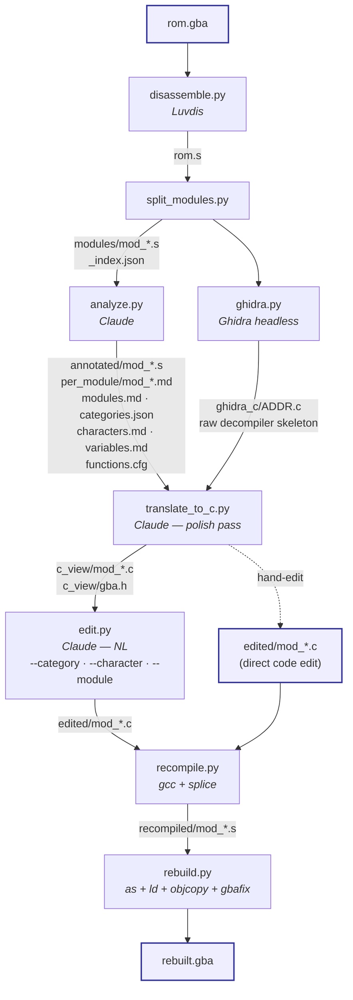

# gba_convert

An end-to-end pipeline that takes a GBA ROM, produces a readable C view
of every function, lets you edit the C (in code or via natural language),
and splices the recompiled bytes back into a working `.gba`.

The output is a **controlled-delta ROM**: unchanged regions stay
byte-identical to the original; only the functions you touched change.

See [PROCESS.md](PROCESS.md) for the full design doc, including why
C (not Python) for the intermediate representation.

---

## Quick start

```sh
cd tools/gba_convert

# 1. Python deps (Luvdis + Anthropic SDK)
python3 -m venv .venv
source .venv/bin/activate
pip install -r requirements.txt
pip install -e ../../luvdis   # the bundled Luvdis checkout

# 2. (Optional but recommended) Ghidra for the decompiler skeleton.
#    Without it, translate_to_c.py asks Claude to translate ASM cold.
#    With it, Claude gets a C skeleton and only needs to polish.
export GHIDRA_INSTALL_DIR=/path/to/ghidra_11.x     # or put support/ on PATH

# 3. Analysis (Stage A) — no ARM toolchain needed
export ANTHROPIC_API_KEY=sk-...
python pipeline.py path/to/your_rom.gba

# 4. (Optional) ARM toolchain, required only for edits + rebuild
brew install --cask gcc-arm-embedded     # macOS
brew install gbafix                       # optional, for header checksum

# 5. Edit + rebuild
python edit.py "bump max HP to 999"                # NL → edited/mod_*.c
python edit.py --category audio "mute music"       # or route by category
python edit.py --character Mario "give 3x speed"   # or route by character
python edit.py --module 17 "..."                   # or by module id
python recompile.py                                 # splice compiled bytes
python rebuild.py                                   # → output/rebuilt.gba
```

See [Output artifacts](#output-artifacts) for the full `output/` tree.

---

## Pipeline overview



The arrows show data flow. Each box is a script; its label's italics
note the external tool or model it drives. Everything left of the
`c_view` boundary is **read-only analysis**; everything right of it is
**surgical modification**.

**Context layout** (why the analysis fan-out matters): the per-module
dossiers at `output/per_module/<mod>.md` mean every downstream Claude
call gets only the context it needs — not the whole accumulated
analysis. `variables.md` stays a small, stable glossary so prompt
caching on it actually works.

---

## Components

### Stage A — read-only analysis

| Script | Input | Output | Role |
|---|---|---|---|
| [disassemble.py](disassemble.py) | `rom.gba` | `output/rom.s`, `rom.hash.txt`, `rom.info.txt` | Shells out to [Luvdis](../../luvdis) to produce a single ARMv4 / THUMB disassembly. Records the SHA-1 so later steps can verify round-trip. |
| [split_modules.py](split_modules.py) | `output/rom.s` | `output/modules/mod_NNNN_ADDR.s` + `_index.json` | Cuts `rom.s` at function boundaries (`thumb_func_start`, `arm_func_start`) and at size-based fallback points. Each module is independently analyzable and labels its address range + `kind` (`code` / `data` / `mixed`). |
| [analyze.py](analyze.py) | `modules/*.s` + `CLAUDE.md` + `prompts/module_analysis.md` | `annotated/*.s`, `per_module/<mod>.md` + `per_module/<mod>.json`, `modules.md` index, `categories.json`, `characters.md`, `variables.md` (glossary), `functions.cfg`, `index.sqlite`, `.progress.json` | One Claude call per module. Adds `@` comments to the assembly, and emits a **per-module dossier** at `per_module/<mod>.md` (human-readable) + `.json` sidecar (structured, for the search index) capturing functions, globals, I/O writes, constants, **category**, **character mentions**, notes. Accumulates: `modules.md` (the index table — id / category / one-liner for every module), `categories.json` (grouping by category), `characters.md` (hand-curated + auto-detected character → module map), `functions.cfg` (high-confidence Luvdis seed). At the end of each run, rebuilds `index.sqlite` (FTS5 search index — see `index_db.py`). `kind == "data"` modules are skipped by default. |
| [index_db.py](index_db.py) | `.module_summaries.json` + `per_module/*.json` + `per_module/*.md` + `.character_mentions.json` | `output/index.sqlite` (FTS5) | SQLite + FTS5 search index over analyzer output. Tables: `modules`, `functions`, `io_writes`, `characters` + a contentless FTS5 virtual table over `path`/`category`/`summary`/`dossier_body`. `rebuild()` is destructive (drop + recreate) and runs automatically after `analyze_all`. `search()` returns bm25-ranked `SearchHit`s. `edit.py` uses it to pre-filter Stage 1 from 100+ modules to ~20 before asking Claude to pick. Has its own CLI (`python index_db.py search "..."`) for ad-hoc queries. |
| [ghidra.py](ghidra.py) | `rom.gba` + `ghidra_postscript.py` | `ghidra_c/<ADDR>.c` (one per function) | **Optional.** Runs `analyzeHeadless` with a post-script that walks every recognised function and dumps its Ghidra decompiler output to a file keyed by entry address. Translates the hard structural parts (control flow, locals, types) deterministically and cheaply so Claude only needs to polish. Gracefully skipped if Ghidra isn't installed; `translate_to_c.py` falls back to translating annotated ASM directly. |
| [translate_to_c.py](translate_to_c.py) | `annotated/*.s` + `per_module/<mod>.md` + `variables.md` glossary + `ghidra_c/*.c` (if present) + `prompts/c_view.md` | `c_view/*.c`, `c_view/gba.h`, `.progress_c.json` | One Claude call per module — a **polish pass** on Ghidra's decompiler output (when available). Claude renames `FUN_XXXX` / `DAT_XXXX` to match the glossary + dossier, replaces raw register addresses with `REG_*` macros, swaps `swi(N)` for `bios_*` wrappers, normalizes to `u8`/`u16`/`u32`. Each call reads only this module's dossier + its Ghidra C slice, not the accumulated analysis — so context cost doesn't grow with ROM size. |

### Stage B — editing

| Script | Input | Output | Role |
|---|---|---|---|
| [edit.py](edit.py) | `"bump max HP to 999"` + `c_view/*.c` + `modules.md` + `categories.json` + `.character_mentions.json` + `index.sqlite` + `per_module/<target>.md` (Stage 2 only) + `variables.md` glossary | `edited/mod_*.c` | Two-stage Claude call. **Stage 1 routes**: if no explicit narrowing flag is given, runs an FTS5 keyword search over `index.sqlite` against the user's instruction to pick the top 20 candidates; then Claude reads `modules.md` + glossary + candidate list and picks the target. Routing can also be narrowed *without* the DB or Claude via `--category audio`, `--character Mario`, or `--module 17` (numeric id accepted). **Stage 2 edits**: reads only the target's `per_module/<target>.md` dossier + source, rewrites under hard constraints (signatures immutable, `#include "gba.h"` only, must fit the original byte span). If `arm-none-eabi-gcc` rejects the output, stderr + failed source are fed back and Claude retries up to 3 times. |
| *(alternative)* direct edit | `cp c_view/X.c edited/X.c` + your editor | `edited/mod_*.c` | Skip `edit.py` entirely and write the C yourself. Anything in `edited/` that differs from its `c_view/` twin is picked up by `recompile.py`. |

### Stage C — round trip

| Script | Input | Output | Role |
|---|---|---|---|
| [recompile.py](recompile.py) | `edited/*.c` (diffed against `c_view/*.c`), `annotated/*.s` | `recompiled/mod_*.s`, `build_c/*.o`, `build_c/*.bin` | For each edited module: `gcc -c` → `objcopy --only-section=.text` → raw bytes. Locates the edited function's byte span in the annotated `.s`, checks the compiled length against the original (**fails if over-size** — the edit has to fit). Pads with THUMB nops (`0xC046`) if smaller. Splices those bytes back in, leaving the rest of the module byte-identical. |
| [rebuild.py](rebuild.py) | `annotated/*.s` (or `recompiled/*.s` when present), [linker.ld](linker.ld) | `build/*.o`, `build/rebuilt.elf`, `output/rebuilt.gba` | `arm-none-eabi-as` each `.s` → `.o`, `ld -T linker.ld` → `elf`, `objcopy -O binary` → raw ROM, `gbafix` → correct header checksum, then SHA-1 verify against `rom.hash.txt`. An unspliced rebuild should match the original hash exactly — any drift is a Luvdis or toolchain bug. A spliced rebuild differs at exactly the edited byte spans. |

### Support files

| File | Role |
|---|---|
| [CLAUDE.md](CLAUDE.md) | Shared system prompt for all Claude calls. Contains the GBA memory map, I/O register table, SWI table, calling convention, category taxonomy, and style rules. Cached via prompt caching. |
| [prompts/module_analysis.md](prompts/module_analysis.md) | Per-module user prompt for `analyze.py`. Requires category + character fields in the JSON response. |
| [prompts/c_view.md](prompts/c_view.md) | Per-module user prompt for `translate_to_c.py`. Framed as a polish pass on Ghidra's decompiler output. |
| [prompts/edit_target.md](prompts/edit_target.md) | Stage-1 user prompt for `edit.py` (target selection from `modules.md` index). |
| [prompts/edit_apply.md](prompts/edit_apply.md) | Stage-2 user prompt for `edit.py` (apply + retry, reads target dossier only). |
| [ghidra_postscript.py](ghidra_postscript.py) | Runs *inside* Ghidra's JVM. Iterates every function, invokes the DecompInterface, writes `ghidra_c/<ADDR>.c`. Jython- and PyGhidra-compatible. |
| [linker.ld](linker.ld) | Minimal GBA linker script. Places all module `.text` at `0x08000000` in the declaration order Luvdis emitted — which matches the original ROM layout. |
| [PROCESS.md](PROCESS.md) | Full design doc (why C, surgical-splice model, §11a/§11b invariants). |

### Output artifacts

```text
output/
├── rom.s                         ← raw Luvdis disassembly
├── rom.info.txt                  ← detected ROM title
├── rom.hash.txt                  ← SHA-1 of the original ROM
├── modules/
│   ├── _index.json               ← manifest: path, addr_start, addr_end, kind
│   └── mod_NNNN_ADDR.s
├── annotated/                    ← step 3: ASM + @ comments
│   └── mod_NNNN_ADDR.s
├── per_module/                   ← step 3: one dossier PER module
│   ├── mod_NNNN_ADDR.md          (human-readable: functions, globals,
│   │                              io_writes, constants, category,
│   │                              characters, notes)
│   └── mod_NNNN_ADDR.json        (same facts, structured — feeds index_db)
├── ghidra_c/                     ← step 3.5: Ghidra decompiler output
│   └── AAAAAAAA.c                (one file per function entry address)
├── c_view/                       ← step 4: C edit surface
│   ├── gba.h                     ← shared defs (REG_*, u8/u16/u32, SWI wrappers)
│   └── mod_NNNN_ADDR.c
├── edited/                       ← YOUR edits (from edit.py or hand)
│   └── mod_NNNN_ADDR.c
├── recompiled/                   ← recompile.py output (splice target)
│   └── mod_NNNN_ADDR.s
├── build_c/                      ← gcc intermediates (per-module .o / .bin)
├── build/                        ← as/ld intermediates (rebuilt.elf)
├── rebuilt.gba                   ← final rebuild
├── variables.md                  ← glossary ONLY (hand-edited canonical names)
├── modules.md                    ← index table: id / category / summary per module
├── categories.json               ← {category: [module ids...]}
├── characters.md                 ← character → modules map (auto + hand-curated)
├── functions.cfg                 ← Luvdis config (high-confidence functions)
├── index.sqlite                  ← FTS5 search index (rebuilt by analyze.py)
├── .module_summaries.json        ← sidecar for modules.md
├── .character_mentions.json      ← sidecar for characters.md
├── .progress.json                ← resumable analyze state
└── .progress_c.json              ← resumable C-view state
```

---

## Running individual steps

```sh
# --- Stage A: analysis ---
python pipeline.py rom.gba --only disasm           # just re-run Luvdis
python pipeline.py rom.gba --only split            # just re-chunk rom.s
python pipeline.py rom.gba --only analyze          # step 3   (ASM annotate + dossiers)
python pipeline.py rom.gba --only ghidra           # step 3.5 (Ghidra decompile)
python pipeline.py rom.gba --only cview            # step 4   (→ C view, polish)
python pipeline.py rom.gba --skip-analyze          # disasm + split, no LLM, no Ghidra
python pipeline.py rom.gba --skip-ghidra           # skip Ghidra (use when not installed)
python pipeline.py rom.gba --skip-cview            # disasm + split + analyze + ghidra
python pipeline.py rom.gba --only cview --force    # redo completed modules
python pipeline.py rom.gba --only analyze --limit 3  # smoke-test on 3 mods

# --- Stage B: edits ---
python edit.py "bump max HP to 999"                  # NL → Claude picks target
python edit.py --module 17 "bump HP"                 # by numeric id
python edit.py --module mod_0017_080A1B30 "bump HP"  # by filename
python edit.py --category audio "raise master volume 25%"
python edit.py --character Mario "give 3x walk speed"

# Ad-hoc searches against the FTS index (same one edit.py uses):
python index_db.py rebuild                           # drop + recreate
python index_db.py search "joypad" --category input
python index_db.py search "palette fade" --limit 5

# --- Stage C: round trip ---
python recompile.py                                # compile edits + splice
python rebuild.py                                  # → rebuilt.gba
python rebuild.py --no-splice                      # rebuild from annotated/ only
```

Each LLM step is idempotent — `.progress.json` tracks step 3, and
`.progress_c.json` tracks step 4. Delete the relevant file (or pass
`--force`) to redo that pass.

---

## Tuning

- `--default-mode BYTE|THUMB|WORD` — Luvdis's fallback for unknown
  addresses. `BYTE` is safe; `THUMB` gives cleaner output on code-heavy
  ROMs but can mis-disassemble data.
- `--max-lines 1500` — max lines per module chunk. Smaller = more LLM
  calls but better focus; larger = cheaper but risks hitting context
  limits on complex modules.
- `--model claude-opus-4-7` — any Anthropic model ID. Haiku is fine for
  a cheap triage pass on `analyze`; switch to Opus for `cview` and edits.
- `--include-data` — by default, `kind == "data"` modules are skipped in
  `analyze` and `cview` (no point sending `.byte` dumps to an LLM). Pass
  this to process them anyway.
- `--limit N` — process at most N modules in each LLM step. Useful for
  smoke-testing the pipeline cheaply before a full run.

---

## Changing a ROM

If you run `pipeline.py` against a different ROM than last time, the
existing `output/` is auto-archived to `output.<shortsha>/` so previous
runs aren't clobbered.

---

## What's not included

- Graphics / tileset / text extraction — separate tools.
- Multi-function-per-module edits — `recompile.py` assumes one edited
  function per module. Editing two in the same module works only if
  their combined size still fits the original span.
- Relocation — if your edit doesn't fit in the original byte span,
  `recompile.py` fails. There is no out-of-line trampoline path yet.
- `.rodata` splicing — only `.text` is currently swapped back in. If an
  edit introduces new read-only data, it'll be dropped at the
  `objcopy --only-section=.text` step.

---

## Files

| File                         | Purpose                                                |
|------------------------------|--------------------------------------------------------|
| `pipeline.py`                | CLI orchestrator (Stage A)                              |
| `disassemble.py`             | Step 1 — wraps local Luvdis                             |
| `split_modules.py`           | Step 2 — chunks rom.s                                   |
| `analyze.py`                 | Step 3 — ASM annotation + per-module dossiers via Claude|
| `ghidra.py`                  | Step 3.5 — drives `analyzeHeadless` to dump decomp C    |
| `ghidra_postscript.py`       | Runs inside Ghidra; writes `ghidra_c/<ADDR>.c` per fn   |
| `translate_to_c.py`          | Step 4 — polish Ghidra's C with dossier + glossary      |
| `edit.py`                    | Stage B — natural-language edits via Claude + retry     |
| `recompile.py`               | Stage C — compile edited C + splice bytes               |
| `rebuild.py`                 | Stage C — `as` + `ld` + `objcopy` + `gbafix` → `.gba`   |
| `linker.ld`                  | GBA linker script for `rebuild.py`                      |
| `CLAUDE.md`                  | System prompt (shared across all Claude calls)          |
| `prompts/module_analysis.md` | Per-module prompt for step 3                            |
| `prompts/c_view.md`          | Per-module prompt for step 4 (polish pass)              |
| `prompts/edit_target.md`     | Stage-1 prompt for `edit.py` (target selection)         |
| `prompts/edit_apply.md`      | Stage-2 prompt for `edit.py` (apply + retry)            |
| `scripts/edit_by_module.sh`  | One-liner: `edit.py --module <id>` + recompile + rebuild|
| `scripts/edit_by_category.sh`| One-liner: `edit.py --category <cat>` + recompile + rebuild|
| `PROCESS.md`                 | Full design doc                                         |
